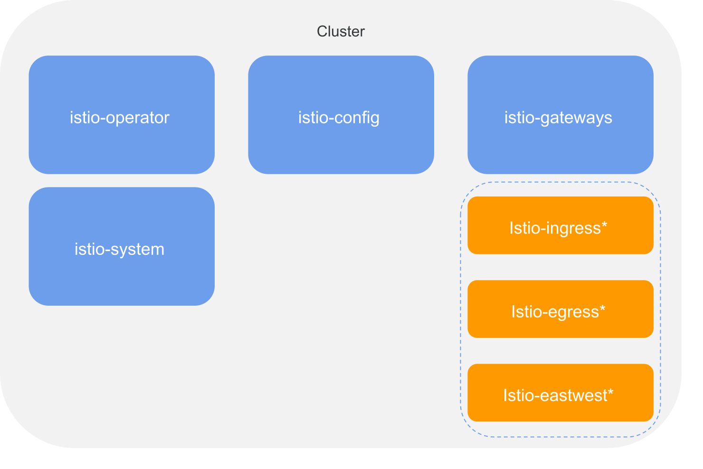

# Istio Namespace Planning

The latest Istio versions have updated their istio deployment models and how it relates to namespaces. The current reccommendation recommends separating out namespaces for the below due mainly to security reasons. We will go deeper into each namespace.

Istio separate namespace recommendations

1. Istio Operator: `istio-operator`
2. Istiod: `istio-system`
3. Istio configuration: `istio-config`
4. Istio Gateways: `istio-gateways` OR `istio-ingress, istio-egress, istio-eastwest`



## Istio Operator Namespace

* `istio-operator`

Deploying the istio operator to its own namespace is recommended so that it can be properly permissioned to manage deployments of both istiod and the istio gateways.
When deploying with this model you may need to add additional `watchedNamespaces`.

Example Isito Operator Install (single gateway namespace)

```sh
helm install istio-operator manifests/charts/istio-operator \
  --set operatorNamespace=istio-operator \
  --set watchedNamespaces="istio-system\,istio-gateways"
```

Example Isito Operator Install (gateway per namespace)

```sh
helm install istio-operator manifests/charts/istio-operator \
  --set operatorNamespace=istio-operator \
  --set watchedNamespaces="istio-system\,istio-ingress\,istio-egress\,istio-eastwest"
```

## Istiod Namespace

* `istio-system`

The istiod namespace typically retains the `istio-system` name. It is now recommended to only deploy control plane infrastructure and configuration to this namespace. All dataplane configuration (VirtualServices/DestinationRules etc) should now be deployed to `istio-config`.

## Istio Configuration Namespace

* `istio-config`

This is Istio's new `rootNamespace` where all global istio dataplane configuration should be stored. It is recommended to deploy specific istio configurations to the service owners namespace (discussed more in [./configuration_management](./configuration_management) page)

## Istio Gateway Namespace(s)

* `istio-gateways`
* `istio-ingress, istio-egress, istio-eastwest`

Istio recommends that the gateways now be deployed outside of the istiod namespace. This is due to the potential risk of the gateways being able to mount secrets they should not have access to in the istiod namespace.

Depending on security and management requirements, it may make sense to isolate individual gateway deployments into their own namespaces for ingress/egress/eastwest gateways (shown as optional in the above document).
